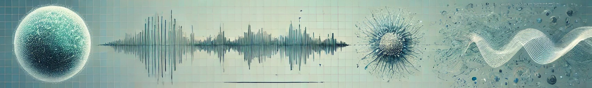

# UCSB - ECE 178: Introduction to digital image processing

## General Information

|               | Name                  | Email               | Office hours                                        |  Lectures                          | Location    |
----------------|-----------------------|---------------------|-----------------------------------------------------|------------------------------------|-------------|
|**Instructor** | Niels Volkmann        | nvo@ucsb.edu        | By appointment; Zoom                                | M, W 3:30 - 4:15PM                 | Phelps 1260 |
|               |                       |                     |                                                     | 
 **Discussions** |             |
|**TAs**        | Anantajit Subrahmanya | anantajit@ucsb.edu  | Tu 11:00 - 12:00PM; TBA   Th 11:00 - 12:00PM; TBA| F 10:00 - 10:50AM                  | GIRV 2112   |
|               | Hardik Prajapati      | hprajapati@ucsb.edu | W 2:15 - 3:15PM; TBA   Th 11:00 - 12:00PM; TBA   | F 12:00 - 12:50PM                  | GIRV 1220   |

## Course Description
This course offers an introduction to digital image processing. You will learn about digital images and how to manipulate them. You should have a good background in basic calculus and programming in Python as there will be programming assignments that will require coding. Discussion sections are mandatory and will have occasional quizzes that cover the material up to what was discussed in class. The main source of information will be this github site and you should check it regularly for updates. There will be Homework that will  consist of written assignments as well as Python programming assignments. These will be due every week on Wednesday at 11:59pm sharp. Late homeworks will be severely penalized 33% per day, so anything submitted after 72 hours late will receive zero credit. We set up a chat in the [Discussions section](https://github.com/nv-ucsb-courses/dip_intro/discussions/3) of this site as a class forum for you to post questions about the homework or other public questions.

## Grading
40% Homework (including programming assignments, and quizzes). Note that the weight for each homework will vary, depending on the level of difficulty of the questions/programming assignments. 20% Mid-term examination, and 40% for the final examination. There will be an in-class midterm (Wednesday, Oct. 30) and a final exam (Wednesday Nov. 12). These exams will be closed-book, closed-notes; we will provide a formula sheet for you to use if necessary. Make every effort to show up on time for the regular, scheduled exam times.

## Textbook
* Rafael C. Gonzalez and Richard E. Woods. *Digital Image Processing (4th Edition)*. Pearson, 2018.

## Course Schedule
The following is the approximate schedule for the topics of this course. THe chapters (CH) in the Reading column refer to the textbook above. Exact order of topics are subject to change:

| Week | Date  | Topics                                                    | Reading       |
|------|-------|-----------------------------------------------------------|---------------|
| 1    | 09/30 | Intro to Image Processing, Image Representations          | CH 1, 2.4-2.5 |
| 2    | 10/07 | Visual Perception, Image Acquisition                      | CH 2.1-2.3    |
| 3    | 10/14 | Histogram Transformations, Spatial Filtering              | CH 2.6, 3     |
| 4    | 10/21 | 2D Fourier Transform, Aliasing, Sampling                  | CH 4.1-4.2    |
| 5    | 10/28 | Midterm Review (10/28), **Midterm (Wed 10/30, in class)** |               |
| 6    | 11/04 | Image Restoration, Denoising, Deconvolution               | CH 5          |
| 7    | 11/11 | *(Mon 11/11, Veterans Day)* Image Compression             | CH 8          |
| 8    | 11/18 | *(Mon 11/18, no Class)* Morphological Operations          | CH 9          |
| 9    | 11/25 | *(Fri 11/28, Thanksgiving)* Biomedical Image Processing   | Papers        |
|10    | 12/02 | Biomedical Image Processing, Finals Review (Wed 12/04)    | Papers        |
|11    | 12/09 | **Wed 11/12, 2-5 PM Final Examination**                   |               |

